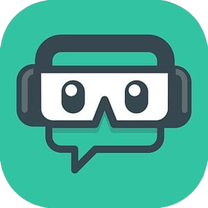
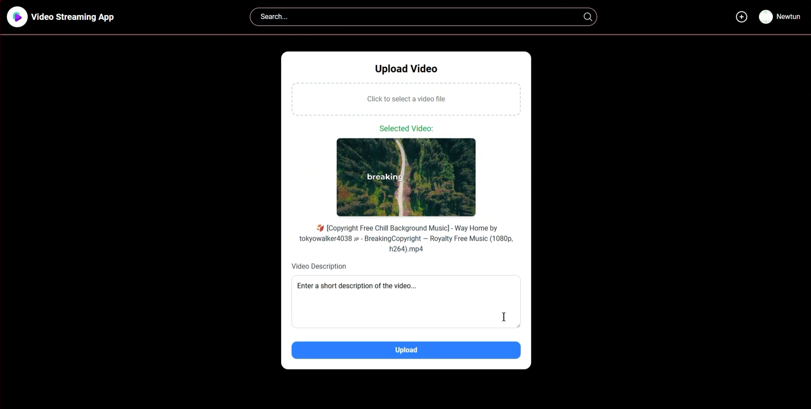
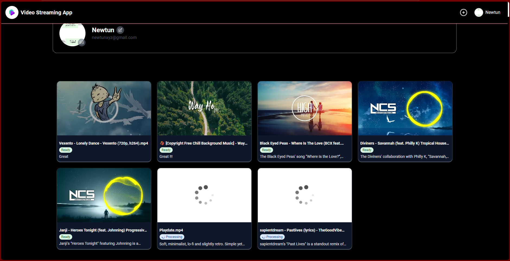
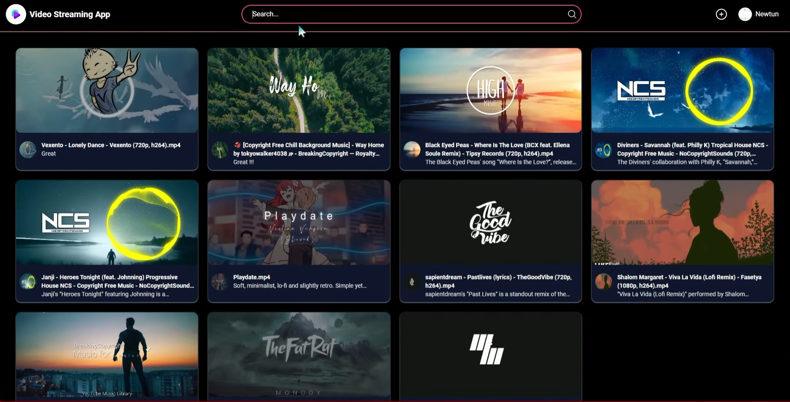
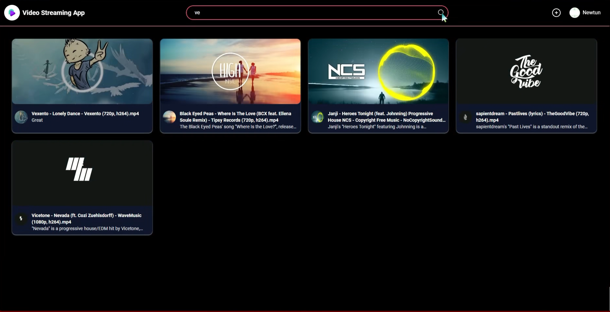
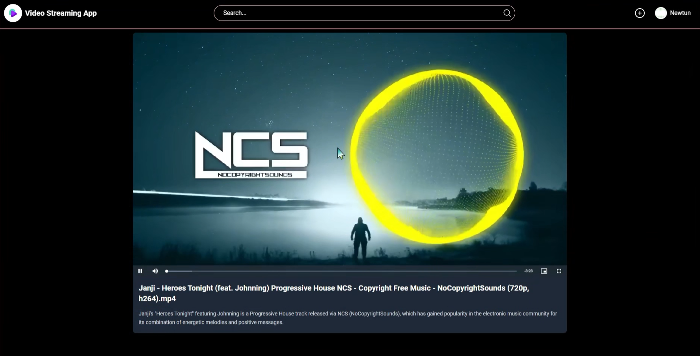

<h1 align="center">
    <br>
    </img>
    <br>
    Video Streaming App - Microservice
    <br>
</h1>

<h4 align="center">Video streaming app built with microservices architecture, using DASH</h4>

<p align="center">
    
    
</p>

<p align="center">
    <a href="#key-features">Key Features</a> •
    <a href="#demo">Demo</a> •
    <a href="#prerequisite">Prerequisite</a> •
    <a href="#how-to-use">How To Use</a> •
</p>


## Key Features

* Upload Video - use <b>FFMPEG</b> tool to convert video to <b>Dash</b> format and store with Minio, track video upload status.
* Split video into small segments for more efficient delivery.
* Deliver video via <b>DASH protocol</b>.
* Provide API for user video management.
* Search video by name.

## Demo












## Prerequisite

             

## How To Use

To run app with source code, You need to install the following technologies before running the application. These are required components for the application to function as designed.

To clone and run this application, you'll need [Git](https://git-scm.com) from your command line:

```bash
# Clone this repository
$ git clone https://github.com/VinhTin-AQUA/Video-Streaming-App.git
```

```yaml
# Run docker compose to build important containers (Kafka, Minio)
docker compose up -d
```

With auth-service, video-metadata-service, user-service

```bash
# cd to folder (auth-service, video-metadata-service, user-service)
$ npm i
$ npm run start:dev
```

With StreamingService, TranscodingService, VideoUploadService, API-Gateway
```bash
# open project in Visual Studio 2022 and run
```

With video-app-client

```bash
# cd to folder video-app-client
$ npm i
$ ng s
```

* .env file in auth-service
```env
MONGODB_URI=mongodb://127.0.0.1:27017/auth-service?replicaSet=rs0

JWT_ACCESS_TOKEN_SECRET=37F8QYv58OsIZCcPKDdmXSq9nREt4uB8
JWT_ACCESS_TOKEN_EXPIRE_MINUTES=30000000
JWT_ISSUER=http://localhost:5246
JWT_VALIDAUDIENCE=http://localhost:5246

EMAIL_ADDRESS=example@gmail.com
EMAILL_APP_PASSWORD=ghuytrdfrtiopkng
EMAIL_HOST=smtp.gmail.com
EMAIL_PORT=587

KAFKA_URI=localhost:9092
KAFKA_AUTH_GROUP_ID=auth-service-consumer
```

* .env video-metadata-service
```env
MONGODB_URI=mongodb://127.0.0.1:27017/video-metadata-service?replicaSet=rs0

MINIO_PROTOCOL=http
MINIO_ENDPOINT=localhost
MINIO_PORT=8000
MINIO_BASEURL=localhost:8000
MINIO_ACCESSKEY=TdjrHw0IxoslRZJViVfM
MINIO_SECRETKEY=MgeTmft4mVRtuwFJcrG0u271Dpb9oRpXRpxVNvBu
```

* .env user-service
```env
MONGODB_URI=mongodb://127.0.0.1:27017/user-service?replicaSet=rs0

KAFKA_URI=localhost:9092
KAFKA_USER_GROUP_ID=user-management-consumer

MINIO_PROTOCOL=http
MINIO_ENDPOINT=localhost
MINIO_PORT=8000
MINIO_BASEURL=localhost:8000
MINIO_ACCESSKEY=TdjrHw0IxoslRZJViVfM
MINIO_SECRETKEY=MgeTmft4mVRtuwFJcrG0u271Dpb9oRpXRpxVNvBu
```

## Conclude

Thank you for visiting my repository, if any problem arises please create a pull request or contact via email: tinhovinh@gmail.com
